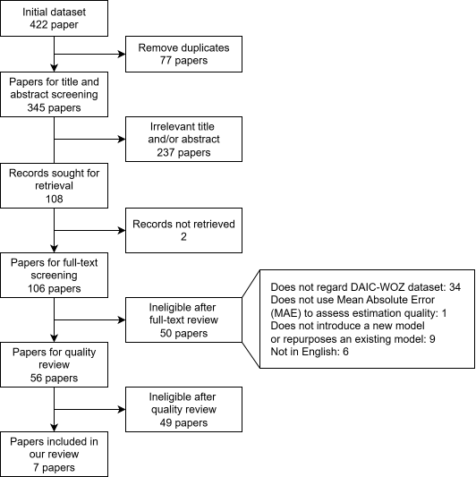
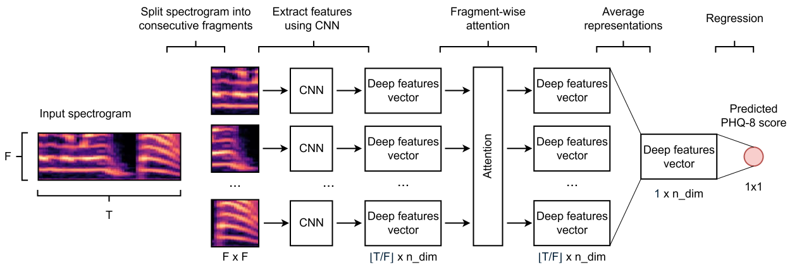

# Common Pitfalls and Recommendations for Use of Machine Learning in Depression Severity Estimation: DAIC-WOZ Study

## PRISMA flowchart

## Empirical demonstration of subject leakage pitfall

## Steps to reproduce

Below is the list of steps required to reproduce the results of our paper from scratch:
 1. _(terminal)_ Clone this repo: `git clone https://github.com/Kowd-PauUh/ml-in-depression-estimation.git && cd ml-in-depression-estimation`
 2. _(terminal)_ Build and start Docker container: `make build && make start`
 3. _(terminal)_ Start MLFlow server: `make mlflow`
 4. _(terminal)_ In new terminal enter container shell: `make shell`
 5. _(container shell)_ Execute DAIC dataset download (step 1): `sh src/scripts/data/download_data.sh` 
 6. _(container shell)_ Execute DAIC dataset download (step 2): `sh src/scripts/data/download_metadata.sh` 
 7. _(container shell)_ Preprocess data: `python3 src/scripts/data/preprocess_data.py`
 8. _(container shell)_ Split data: `python3 src/scripts/data/split_data.py`
 9. _(container shell)_ Reproduce training results: (i) without data leakage `sh src/scripts/fine_tuning/reproduce_no_leakage.sh`, (ii) with data leakage `sh src/scripts/fine_tuning/reproduce_leakage.sh`

You can omit data download and set different data paths than default. 
For more information examine [data_module.py](src/training/fine_tuning/data_module.py) and [repeated_fine_tune_cnn.py](/src/scripts/fine_tuning/repeated_fine_tune_cnn.py)
